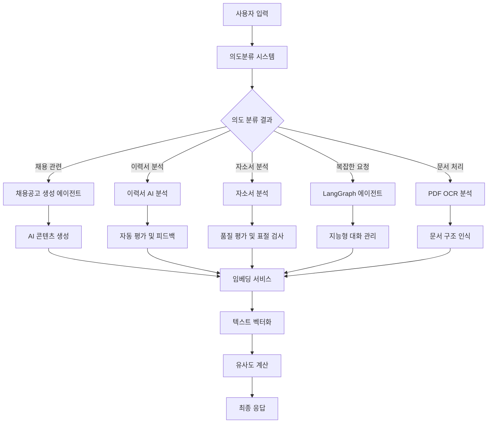

# 🤖 AI 작용 영역 분석

이 문서는 프로젝트에서 AI가 작용하는 모든 영역을 체계적으로 분석한 결과입니다.

## 📋 목차
- [AI 작용 영역 분석](#-ai-작용-영역-분석)
  - [📋 목차](#-목차)
  - [1. 의도분류 및 자연어 처리 (NLP)](#1-의도분류-및-자연어-처리-nlp)
  - [2. LangGraph 에이전트 시스템](#2-langgraph-에이전트-시스템)
  - [3. 이력서 AI 분석](#3-이력서-ai-분석)
  - [4. 채용공고 생성 에이전트](#4-채용공고-생성-에이전트)
  - [5. 임베딩 및 유사도 분석](#5-임베딩-및-유사도-분석)
  - [6. PDF OCR 및 AI 분석](#6-pdf-ocr-및-ai-분석)
  - [7. 자소서 분석](#7-자소서-분석)
  - [🏗️ AI 아키텍처 다이어그램](#️-ai-아키텍처-다이어그램)
  - [📊 AI 작용 영역 요약](#-ai-작용-영역-요약)
  - [🔧 기술 스택](#-기술-스택)
  - [📈 성능 최적화](#-성능-최적화)

---

## 1. 의도분류 및 자연어 처리 (NLP)

### 📍 위치
```
backend/chatbot/core/intent_classifier.py
```

### 🤖 AI 모델
- **GPT-4o**

### ⚙️ 기능
- 사용자 입력의 의도 분류 (채용, 질문, 대화 등)
- 엔티티 추출 (부서, 경력, 급여 등)
- 신뢰도 점수 계산

### 🔍 상세 설명
의도분류기는 사용자의 자연어 입력을 분석하여 의도를 파악하고, 관련 엔티티를 추출하는 핵심 AI 컴포넌트입니다. 정규식 패턴 매칭과 AI 모델을 결합하여 높은 정확도의 의도 분류를 제공합니다.

---

## 2. LangGraph 에이전트 시스템

### 📍 위치
```
backend/modules/ai/services/langgraph_agent_system.py
```

### 🤖 AI 모델
- **GPT-4o**

### ⚙️ 기능
- 복잡한 의도 분석 및 라우팅
- 툴 실행 결정
- 대화 컨텍스트 관리
- 혼합 의도 처리

### 🔍 상세 설명
LangGraph 기반의 고급 에이전트 시스템으로, 복잡한 사용자 요청을 단계별로 처리하고 적절한 툴을 선택하여 실행합니다. 대화 컨텍스트를 유지하면서 지능적인 응답을 생성합니다.

---

## 3. 이력서 AI 분석

### 📍 위치
```
backend/modules/ai/resume_analysis_service.py
```

### 🤖 AI 모델
- **OpenAI**: GPT-4o-mini (5개 항목 평가)
- **HuggingFace**: 로컬 모델 (7개 항목 평가)

### ⚙️ 기능
- 이력서 내용 분석 및 점수 평가
- 학력, 경력, 기술, 프로젝트, 성장도 평가
- 상세 피드백 및 개선 제안

### 🔍 상세 설명
이력서의 내용을 AI가 자동으로 분석하여 객관적인 점수를 부여하고, 구체적인 피드백을 제공합니다. OpenAI와 HuggingFace 모델을 모두 지원하여 다양한 분석 옵션을 제공합니다.

---

## 4. 채용공고 생성 에이전트

### 📍 위치
```
backend/modules/job_posting/enhanced_job_posting_agent.py
```

### 🤖 AI 모델
- **GPT-4o**

### ⚙️ 기능
- 사용자 입력 분석 및 키워드 추출
- 동적 템플릿 선택
- 채용공고 내용 자동 생성
- 출력 검증 및 품질 관리

### 🔍 상세 설명
사용자의 요구사항을 분석하여 적절한 채용공고 템플릿을 선택하고, AI가 자동으로 채용공고 내용을 생성합니다. 생성된 내용의 품질을 검증하여 최적의 결과를 제공합니다.

---

## 5. 임베딩 및 유사도 분석

### 📍 위치
```
backend/modules/core/services/embedding_service.py
```

### 🤖 AI 모델
- **OpenAI**: text-embedding-3-small
- **백업**: SentenceTransformer (paraphrase-multilingual-MiniLM-L12-v2)

### ⚙️ 기능
- 텍스트 벡터화
- 유사도 계산
- 검색 최적화

### 🔍 상세 설명
텍스트를 벡터로 변환하여 의미적 유사도를 계산하고, 검색 성능을 최적화합니다. OpenAI의 임베딩 모델을 주로 사용하며, 백업용 로컬 모델도 지원합니다.

---

## 6. PDF OCR 및 AI 분석

### 📍 위치
```
backend/pdf_ocr_module/core/ai_analyzer.py
```

### 🤖 AI 모델
- **GPT-4o**

### ⚙️ 기능
- PDF 텍스트 추출
- 이력서 구조 분석
- 기본 정보 추출

### 🔍 상세 설명
PDF 문서에서 텍스트를 추출하고, AI가 이력서의 구조를 분석하여 기본 정보를 자동으로 추출합니다. OCR과 AI 분석을 결합한 고급 문서 처리 시스템입니다.

---

## 7. 자소서 분석

### 📍 위치
```
backend/modules/core/services/cover_letter_analysis/analyzer.py
```

### 🤖 AI 모델
- **GPT-4o**

### ⚙️ 기능
- 자소서 내용 분석
- 표절 의심도 검사
- 품질 평가

### 🔍 상세 설명
자소서의 내용을 분석하여 품질을 평가하고, 표절 의심도를 검사합니다. 지원자의 자기소개서를 객관적으로 평가하여 채용 과정을 지원합니다.

---

## 🏗️ AI 아키텍처 다이어그램



---

## 📊 AI 작용 영역 요약

### 🎯 핵심 AI 영역 7개

| 영역 | 시스템 | 주요 기능 | AI 모델 |
|------|--------|-----------|---------|
| 🧠 | 의도분류 시스템 | 사용자 입력 이해 | GPT-4o |
| 🤖 | LangGraph 에이전트 | 지능형 대화 관리 | GPT-4o |
| 📄 | 이력서 AI 분석 | 자동 평가 및 피드백 | GPT-4o-mini, HuggingFace |
| 📝 | 채용공고 생성 | AI 기반 콘텐츠 생성 | GPT-4o |
| 🔍 | 임베딩 서비스 | 텍스트 벡터화 및 검색 | OpenAI Embeddings, SentenceTransformer |
| 📋 | PDF OCR 분석 | 문서 구조 인식 | GPT-4o |
| ✍️ | 자소서 분석 | 품질 평가 및 표절 검사 | GPT-4o |

### 🤖 사용되는 AI 모델

| 모델 | 용도 | 특징 |
|------|------|------|
| **GPT-4o** | 메인 대화 및 분석 | 고성능, 다목적 |
| **GPT-4o-mini** | 경량 분석 작업 | 빠른 처리, 비용 효율적 |
| **HuggingFace 모델** | 로컬 오프라인 분석 | 프라이버시 보호, 오프라인 동작 |
| **OpenAI Embeddings** | 텍스트 벡터화 | 고품질 임베딩 |
| **SentenceTransformer** | 백업 임베딩 | 로컬 처리, 다국어 지원 |

---

## 🔧 기술 스택

### 백엔드 AI 서비스
- **OpenAI API**: GPT-4o, GPT-4o-mini, text-embedding-3-small
- **HuggingFace**: 로컬 AI 모델
- **LangGraph**: 에이전트 워크플로우 관리
- **SentenceTransformer**: 백업 임베딩 모델

### 프론트엔드 AI 연동
- **React**: AI 분석 결과 시각화
- **Styled Components**: AI 모달 및 컴포넌트 스타일링
- **Framer Motion**: AI 분석 애니메이션

---

## 📈 성능 최적화

### 하이브리드 로딩
- **지연 로딩**: 필요 시에만 AI 모델 로드
- **사전 로딩**: 빠른 시작을 위한 모델 사전 로드
- **백업 시스템**: 메인 모델 실패 시 백업 모델 사용

### 캐싱 전략
- **임베딩 캐시**: 동일한 텍스트의 임베딩 재사용
- **분석 결과 캐시**: 이력서 분석 결과 저장
- **세션 관리**: 대화 컨텍스트 유지

### 모니터링
- **성능 메트릭**: 처리 시간, 정확도 추적
- **에러 로깅**: AI 서비스 오류 모니터링
- **사용량 통계**: API 호출량 및 비용 관리

---

*이 문서는 프로젝트의 AI 아키텍처를 체계적으로 분석한 결과입니다. 각 AI 영역의 역할과 상호작용을 이해하여 시스템의 전체적인 구조를 파악할 수 있습니다.*
