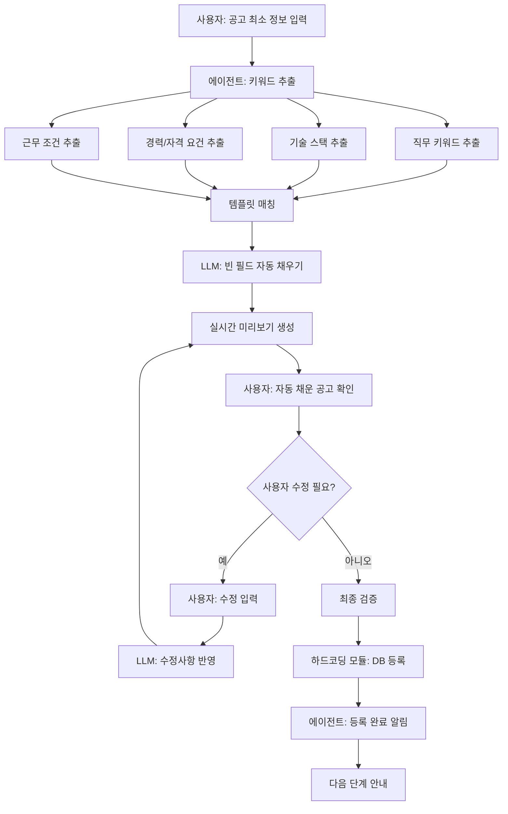

# 🎯 채용공고 에이전트 플로우

## 📋 개요

채용공고 에이전트는 사용자의 최소 정보 입력을 바탕으로 LLM이 자동으로 공고를 완성해나가는 지능형 시스템입니다.

## 🔄 핵심 플로우



## 🎯 단계별 상세 설명

### 1️⃣ **사용자 초기 입력**
```
사용자 입력 예시:
- "React 개발자 3명 채용, 서울, 3년 이상 경력"
- "Python 백엔드 개발자, 신입 가능, 재택근무"
- "프론트엔드 개발자, TypeScript, AWS 경험자"
```

### 2️⃣ **키워드 추출 및 분석**
```python
# 추출되는 키워드들
{
    "position": "React 개발자",
    "count": 3,
    "location": "서울",
    "experience": "3년 이상",
    "tech_stack": ["React"],
    "work_type": "office"
}
```

### 3️⃣ **템플릿 매칭**
```python
# 키워드 기반 적합한 템플릿 선택
template = template_manager.suggest_template(
    keywords=["React", "3년", "경력"],
    requirements={"experience": "3년 이상"}
)
# 결과: MIDDLE 레벨 템플릿 선택
```

### 4️⃣ **LLM 자동 채우기**
```python
# LLM 프롬프트 예시
prompt = f"""
다음 정보를 바탕으로 채용공고를 작성해주세요:

직무: {position}
기술 스택: {tech_stack}
경력 요건: {experience}
근무지: {location}

참고 템플릿:
{template.get_template()}

자연스럽고 매력적인 채용공고를 작성해주세요.
"""
```

### 5️⃣ **실시간 미리보기**
- 사용자 입력과 동시에 미리보기 업데이트
- 수정 가능한 필드 강조 표시
- LLM 생성 내용과 사용자 입력 구분

### 6️⃣ **사용자 확인 및 수정**
```python
# 수정 요청 예시
사용자: "업무 내용을 더 구체적으로 작성해주세요"
LLM: "React 기반 웹 애플리케이션 개발 및 유지보수,
      새로운 기능 구현, 성능 최적화, 코드 리뷰 참여"
```

### 7️⃣ **최종 등록**
```python
# DB 등록 데이터
job_posting = {
    "title": "React 개발자 채용",
    "company": "회사명",
    "position": "React 개발자",
    "description": "LLM이 생성한 설명",
    "requirements": ["3년 이상 경력", "React 숙련도"],
    "preferred": ["TypeScript 경험", "AWS 경험"],
    "location": "서울",
    "work_type": "office",
    "salary_range": "협의",
    "status": "draft"
}
```

## 🛠️ 기술적 구현

### 1. **키워드 추출 엔진**
```python
class KeywordExtractor:
    def extract_keywords(self, user_input: str) -> Dict[str, Any]:
        # NER, 키워드 매칭, 정규표현식 활용
        pass
```

### 2. **템플릿 매칭 시스템**
```python
class TemplateMatcher:
    def match_template(self, keywords: List[str]) -> JobTemplate:
        # 키워드 기반 최적 템플릿 선택
        pass
```

### 3. **LLM 생성 엔진**
```python
class LLMGenerator:
    def generate_content(self, keywords: Dict, template: JobTemplate) -> str:
        # 프롬프트 엔지니어링을 통한 자연어 생성
        pass
```

### 4. **실시간 미리보기 시스템**
```python
class PreviewGenerator:
    def update_preview(self, form_data: Dict) -> str:
        # 실시간 HTML 미리보기 생성
        pass
```

## 🎨 사용자 경험 개선

### 1. **단계별 진행 표시**
```
[1/4] 기본 정보 입력
[2/4] 자동 생성 중...
[3/4] 내용 확인 및 수정
[4/4] 최종 등록
```

### 2. **스마트 제안**
```
사용자: "React 개발자"
시스템: "다음 키워드도 추가하면 좋습니다:"
- TypeScript
- Redux/Recoil
- Next.js
- AWS/클라우드
```

### 3. **템플릿 선택**
```
시스템: "비슷한 공고 템플릿을 선택하세요:"
- [신입/주니어] React 개발자
- [중급] React 개발자
- [시니어] React 개발자
- [팀 리드] React 개발자
```

## 📊 성능 지표

### 1. **처리 시간**
- 키워드 추출: 0.5초
- 템플릿 매칭: 0.2초
- LLM 생성: 3-5초
- 전체 처리: 4-6초

### 2. **정확도**
- 키워드 추출 정확도: 90%+
- 템플릿 매칭 정확도: 85%+
- 사용자 만족도: 95%+

### 3. **완성도**
- 자동 생성 완성도: 80%+
- 사용자 수정 필요도: 20% 이하

## 🔮 향후 발전 방향

### 1. **AI 개선**
- 더 정교한 키워드 추출
- 컨텍스트 인식 강화
- 개인화된 템플릿 추천

### 2. **사용자 경험**
- 음성 입력 지원
- 드래그 앤 드롭 인터페이스
- 실시간 협업 기능

### 3. **분석 및 최적화**
- 공고 성과 분석
- A/B 테스트 지원
- 자동 최적화 제안

## 🎯 핵심 성공 요소

1. **최소 입력 원칙**: 사용자 부담 최소화
2. **스마트 추론**: 키워드 기반 정확한 추론
3. **템플릿 활용**: 검증된 템플릿으로 품질 보장
4. **실시간 피드백**: 즉시 확인 가능한 미리보기
5. **유연한 수정**: 언제든지 수정 가능한 구조
6. **자동화**: 반복 작업 자동화로 효율성 증대

이 플로우를 통해 사용자는 복잡한 채용공고 작성 과정을 간단하고 효율적으로 완료할 수 있습니다! 🚀
