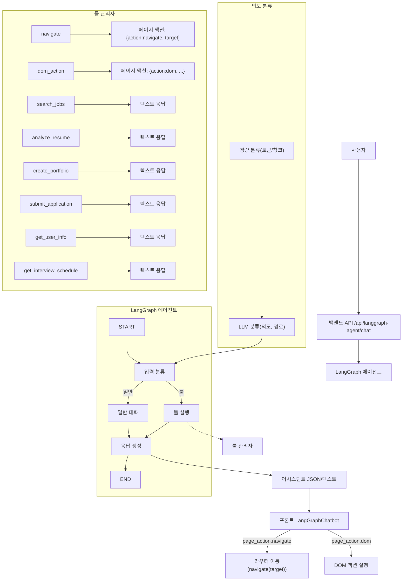

### LangGraph 에이전트 툴 정리

본 문서는 프로젝트 내 LangGraph 에이전트가 사용하는 툴 목록과 동작 정책을 정리합니다.

### 기본 등록 툴(상세설명)
- **search_jobs**: 키워드로 채용 정보를 조회하는 모의 검색 툴. 제목/회사/지역/급여/기술/경력 등을 포함해 결과를 요약 반환합니다.
- **analyze_resume**: 이력서 텍스트에서 기술 스택과 경력 연차를 추출하고, 추천 직무 및 매칭도를 계산해 반환합니다.
- **create_portfolio**: 새 포트폴리오를 생성하고 ID, 생성일, 상태, 접근 URL을 반환합니다.
- **submit_application**: 지원서를 제출 처리하고 지원 ID, 제출일, 상태(예: 검토 중)를 반환합니다.
- **get_user_info**: 사용자 프로필(이름/이메일/전화/가입일/최근 로그인/프로필 완성도/지원·면접 횟수)을 조회합니다.
- **get_interview_schedule**: 예정된 면접 일정(회사/직무/일시/유형/장소/상태)을 조회합니다.
- **navigate**: 자연어 또는 JSON 입력의 target을 기반으로 페이지 이동 명령(JSON)을 생성합니다. 프론트엔드가 이를 수신해 `navigate(target)`를 수행합니다. 허용되지 않은 경로면 대시보드(`/`)로 폴백합니다.
- **dom_action**: 클릭/입력/제출/체크/옵션선택/스크롤/복사·붙여넣기/텍스트 조회/존재 확인 등 DOM 액션 명령(JSON)을 생성합니다. `selector` 또는 자연어 `query`를 사용해 대상 요소를 지정합니다.
- **create_function_tool**: 안전 샘플 코드 기반의 동적 툴을 생성·등록합니다(파일 저장 + 인덱스 업데이트). 관리자 모드 필요합니다.

### 공개 사용 가능 툴 (화이트리스트)
- **navigate**, **dom_action**
  - 별도 권한 없이 실행 가능
  - 그 외 툴은 승인된 동적 툴이거나 관리자 모드일 때만 실행 허용

### 설정상 사용 가능(available_tools)
- search_jobs, analyze_resume, create_portfolio, submit_application, get_user_info, get_interview_schedule, navigate, create_function_tool

### 동적 툴(Dynamic Tools)
- 현재 등록된 동적 툴 없음 (인덱스 파일 부재)
- 관리자 패널을 통해 생성/수정/삭제 가능

### 허용 이동 경로(allowed_routes)
- `/`, `/job-posting`, `/new-posting`, `/resume`, `/applicants`, `/interview`, `/interview-calendar`, `/portfolio`, `/cover-letter`, `/talent`, `/users`, `/settings`
  - 서버/프론트 모두 싱크됨 (navigate 툴에서 화이트리스트 확인)

### 참고 파일 위치
- 툴 구현 및 등록: `backend/langgraph_tools.py`
- 에이전트 설정(화이트리스트/available_tools/allowed_routes 등): `backend/langgraph_config.py`
- 프론트 로컬 네비게이션 보완: `frontend/src/components/LangGraphChatbot.js`

### 에이전트 챗봇 아키텍처 흐름도

